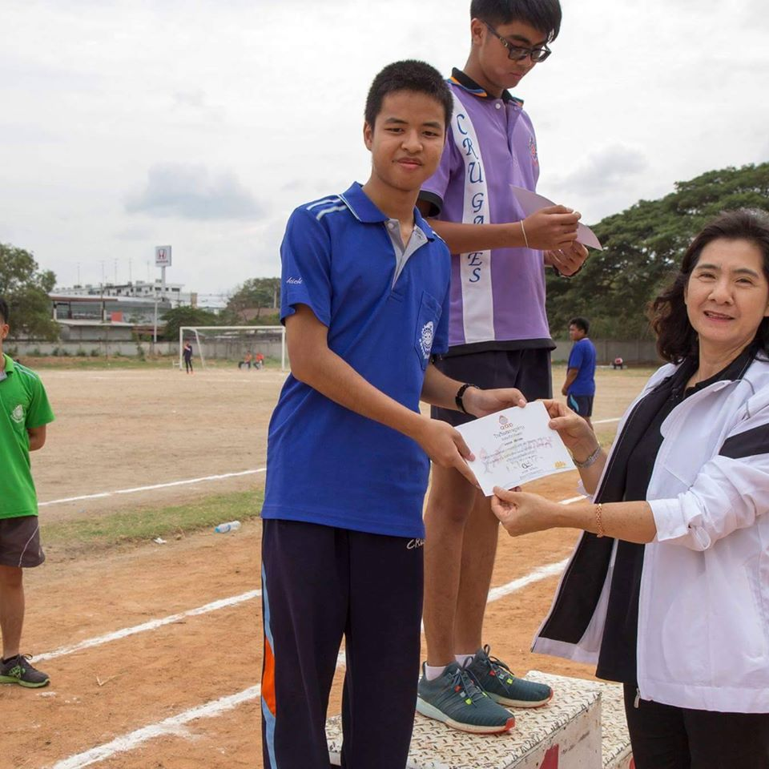
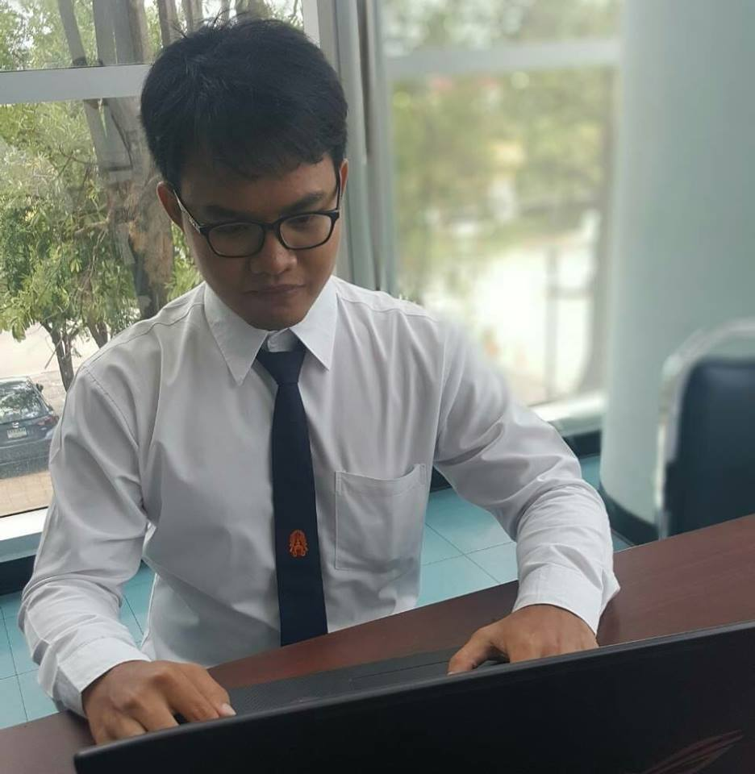
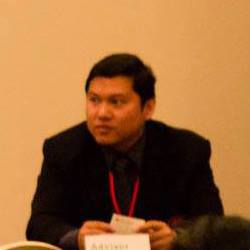

# Fit-Jung-loey
- This is a Project for computer programming 06016315
- โปรเจคนี้ เป็นส่วนหนึ่งของรายวิชา คอมพิวเตอร์โปรแกรมมิ่ง 06016315
---------------------
# Introduction
  - สวัสดีครับ พวกเรากลุ่ม Fit-Jung-Loey ได้สร้างโปรแกรมที่นำไปใช้คิดคำนวณค่า BMI และช่วยในการออกกำลังกาย และสามารถทำงานได้จริง และรองรับการทำงานได้ในหลายระบบปฎิบัติการที่สร้างขื้นจากระบบ UNIX โดยการใช้ภาษา C ในการเขียนโปรแกรม โปรแกรมของเราได้ออกแบบตารางออกกำลังกายและตารางอาหารเพื่อช่วยในการลดน้ำหนักและควบคุมอาหาร
----------------------
# Abstract
 - แอพพลิเคชั่น ฟิตจังเลย(Fit Jung Loei)นี้มีจุดประสงค์จัดทำขึ้นเพื่อเปลี่ยนแปลงพฤติกรรมการบริโภคและการออกกำลังกายของประชากรไทยเพื่อลดปัญหาสุขภาพที่มาพร้อมกับ
น้ำหนักที่เกินมาตรฐานโดยเฉพาะเป้าหมายหลักคือผู้ที่มีน้ำหนักเกินมาตรฐานโดยเฉพาะเป้าหมายหลักคือผู้ที่มีน้ำหนักเกินมาตรฐานหรือเป็นโรคอ้วนซึ่งมีแนวโน้มสูงขึ้นเรื่อยซึ่งจะเป็นแอพพลิเคชั่นที่เกี่ยวกับการดูแลสุขภาพและร่างกายโดยจะให้ความรู้ต่างๆเกี่ยวกับการูและสุขภาพและการควบคุมน้ำหนักเบื้องต้น
----------------------
# Installation
โปรแกรมของเราจำเป็นต้องใช้ gcc และ gtk3+ ในการติดตั้ง

----------------------
 - gcc (https://gcc.gnu.org/)
 
 - gtk3+ (https://www.gtk.org/)
 
 # How to compile program
 
 - gcc -o test test1.c `pkg-config --cflags --libs gtk+-3.0`

##### test1.c คือชื่อไฟล์ของโปรแกรมที่ผู้ใช้จะรัน

##### test คือโปรแกรมหลังจากที่ผู้ใช้รัน gcc

# Member

   |  |ชื่อ|นามสกุล|GitHub Username|รหัสนักศึกษา|
|:-:|--|------|---------------|---------|
||Kittitad|Chinram|[@sKittitadchinram](https://github.com/Kittitadchinram)|61070013|
||Naruebes|Lueangrungudom|[@boatnaruebes](https://github.com/boatnaruebes)|61070100|
||Worachet|Nimcharoen|[@WorachetNimcharoen](https://github.com/WorachetNimcharoen)|61070196|
||Supakkavee|Supho|[@Supakkavee](https://github.com/Supakkavee)|61070251|

# Assistant Teacher
-----------------

<table>
<thead>
<tr>
<th align="center"></a></th>
<th align="center"></a></th>
</tr>
</thead>
<tbody>
<tr>
<td align="center"> Asst Profressor Kitsuchart Pasupa ผศ. ดร. กิติ์สุชาต พสุภา</td>
<td align="center"> Asst Profressor Panwit Tuwanut ผศ. ดร. ปานวิทย์ ธุวะนุติ</td>
</tr>
</tbody>
</table>
